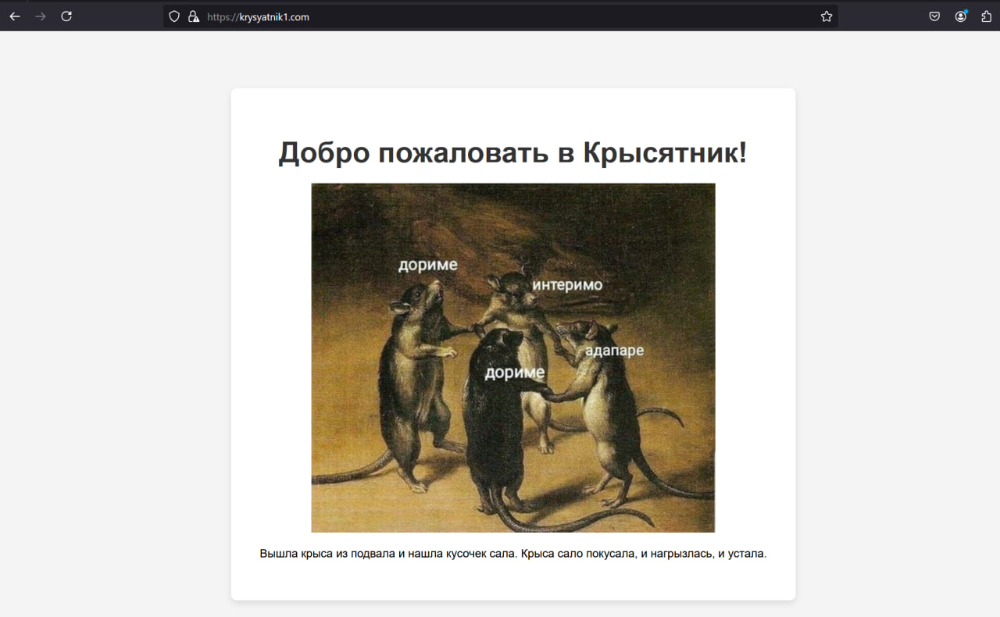
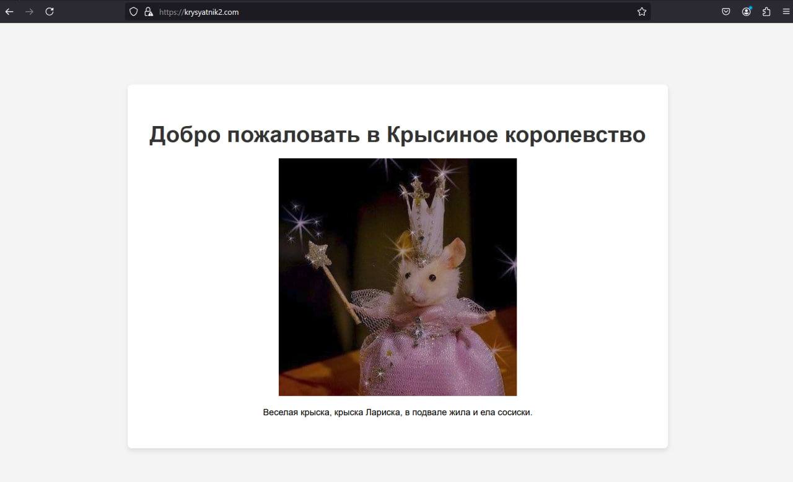

# Лабораторная работа 1
## Задание

Настроить nginx по заданному тз:
1. Должен работать по https c сертификатом
2. Настроить принудительное перенаправление HTTP-запросов (порт 80) на HTTPS (порт 443) для обеспечения безопасного соединения.
3. Использовать alias для создания псевдонимов путей к файлам или каталогам на сервере.
4. Настроить виртуальные хосты для обслуживания нескольких доменных имен на одном сервере.
   
Результат: Предположим, что у вас есть два пет проекта на одном сервере, которые должны быть доступны по https. Настроенный вами веб сервер умеет работать по https, относить нужный запрос к нужному проекту, переопределять пути исходя из требований пет проектов.

## Ход работы

Сначала был установлен Nginx для Windows.

Далее был установлен OpenSSL и создан самоподписанный сертификат, чтобы можно было установить соединение по HTTPS.
```
openssl req -x509 -nodes -days 365 -newkey rsa:2048 -keyout d:\nginx-1.27.2\ssl\nginx.key -out d:\nginx-1.27.2\ssl\nginx.crt
```
Было создано два виртуальных хоста: krysyatnik1.com и krysyatnik2.com и информация о них была занесена в файл hosts. Для каждого из хостов была создана HTML-страница. После этого в кинфигурационном файле настроено перенаправление HTTP-запросов на HTTPS. Также использовался alias для создания псевдонима пути к каталогу styles. В этом каталоге хранится файл со стилями, которые использовались при создании обеих HTML-страниц.
```
#Конфигурация для первого хоста
server {
    listen 80;
    server_name krysyatnik1.com;  
    return 301 https://$host$request_uri;
}

server {
    listen 443 ssl;
    server_name krysyatnik1.com;

    ssl_certificate      D:/nginx-1.27.2/ssl/nginx.crt;
    ssl_certificate_key  D:/nginx-1.27.2/ssl/nginx.key;

    location / {
        root   D:/nginx-1.27.2/html/krysyatnik1;
        index  index.html;
    }
    location /styles {
	alias D:/nginx-1.27.2/html/styles; 
        }
}
```
```
#Конфигурация для второго хоста
server {
    listen 80;
    server_name krysyatnik2.com; 
    return 301 https://$host$request_uri; 
}

server {
    listen 443 ssl;
    server_name krysyatnik2.com;

    ssl_certificate      D:/nginx-1.27.2/ssl/nginx.crt;
    ssl_certificate_key  D:/nginx-1.27.2/ssl/nginx.key;

    location / {
        root   D:/nginx-1.27.2/html/krysyatnik2;
        index  index.html;
    }
   location /styles {
            alias D:/nginx-1.27.2/html/styles;  
        }
}
```
После этого мы запустили nginx, но тут столкнулись с проблемой: при попытке перехода на http://krysyatnik1.com протокол менялся на https, но открывалась страница с ошибкой 404. Для того, чтобы понять из-за чего это происходит мы включили в файл конфигурации лог-файлы.
```
error_log  C:/nginx/logs/error.log;
access_log  C:/nginx/logs/access.log;
```
После перезапуска nginx мы изучили файл error_log, но ничего там не обнаружили. После нескольких неудачных попыток все починить мы решили попробовать запустить nginx с указанием конфигурационного файла который нужно использовать с помощью команды```nginx -c conf/nginx.conf```. И тогда наконец-то все заработало. При вводе адреса hhtp://krysyatnik1.com происходит перенаправление на https://krysyatnik1.com и открывается созданная HTML-страничка.



Точно также открывается krysyatnik2.com и подключение также происходит по протоколу HTTPS.



# Лабораторная работа 1 со звездочкой
## Задание

Попробовать взломать nginx другой команды. Проверить минимум три уязвимости - например path traversal, перебор страниц через ffuf и/или любые другие на ваш выбор.
Взлом считается успешным, если вы попали туда, куда не планировалось попадать пользователю, даже если там ничего нет. Успешность взлома не влияет на оценку лаб обеих команд. 

## Ход работы
В данной работе мы пытались взломать nginx 10 команды (ответочка так сказать).
### Path Traversal
С помощью Path Traversal злоумышленник может получить доступ к файлам, находящихся за пределами основной директории. Использование alias без завершающего / может привести к тому, что злоумышленник потенциально может получить доступ к файлам вне папки css.
```
location /css {
    alias C:/tryn/nginx-1.26.2/html/sminex-news.com/css;
    }
```
Чтобы это исправить, добавим / в конец пути alias, это позволит дать доступ только в той директории, которая указана.
```
location /css/ {
    alias C:/tryn/nginx-1.26.2/html/sminex-news.com/css/;
}
```
### Недостаточная безопасность SSL
В текущей конфигурации SSL у ребят не были установлены дополнительные параметры безопасности. По умолчанию могут использоваться устаревшие SSL/TLS-протоколы. Это делает соединение уязвимым для перехвата, что позволяет злоумышленнику расшифровать трафик или провести атаку типа man-in-the-middle.

Для того, чтобы избавиться от этой уязвимости укажем современные версии протоколов TLS.
```
ssl_protocols TLSv1.2 TLSv1.3;
```
Включим шифры, которые соответствуют высоким стандартам безопасности и отключим слабые шифры, такие как aNULL (без аутентификации) и MD5 (имеющий уязвимости). Также используем параметр ```ssl_prefer_server_ciphers on;``` для того, чтобы сервер выбирал шифры, указанные в его настройках. 
```
ssl_ciphers 'HIGH:!aNULL:!MD5';
ssl_prefer_server_ciphers on;
```
### Перебор страниц через ffuf
Злоумышленник может использовать инструмент ffuf, чтобы перебирать потенциальные URL-адреса на сайте. Поскольку в конфигурации не указаны явные ограничения на доступ к определенным директориям, можно попытаться получить доступ к скрытым страницам, просто подставляя их в URL. Пример использования ffuf:
```
ffuf -w /path/to/wordlist -u https://techzone-catalog.com/FUZZ
```
Если в ```wordlist``` есть слова, такие как ```admin```, ```config```, ```backup```, и эти страницы существуют на сервере, ffuf сможет их обнаружить.

Чтобы устранить эту уязвимость и предотвратить доступ к скрытым страницам, можно ограничить доступ к критическим страницам. Добавим правила, чтобы запретить доступ к определенным директориям или страницам.
```
location /admin {
    deny all;
}
```
Также можно использовать HTTP-аутентификацию. Если пользователь пытается зайти на /admin, сервер возвращает ответ с кодом 401 (не авторизован), и браузер отображает диалоговое окно для ввода имени пользователя и пароля, доступ будет открыт только если введенные данные совпадают с теми, которые указаны в файле .htpasswd.
```
location /admin {
    auth_basic "Restricted Area";
    auth_basic_user_file /etc/nginx/.htpasswd;
}
```

### Мы, делая эту лабу:

