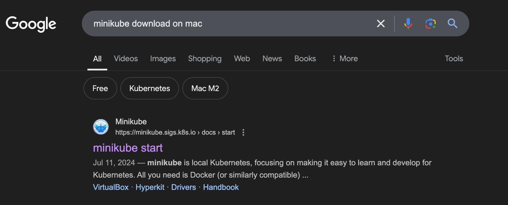
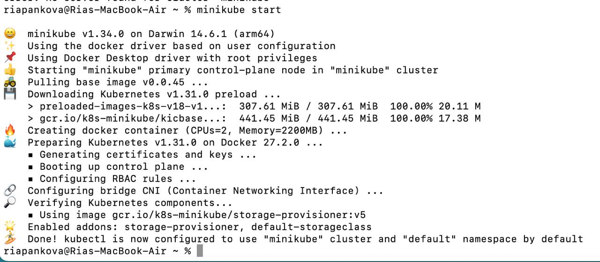
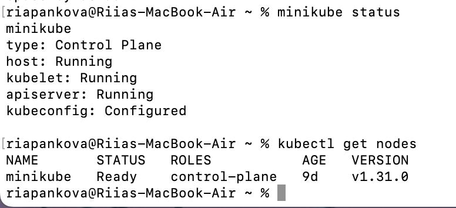
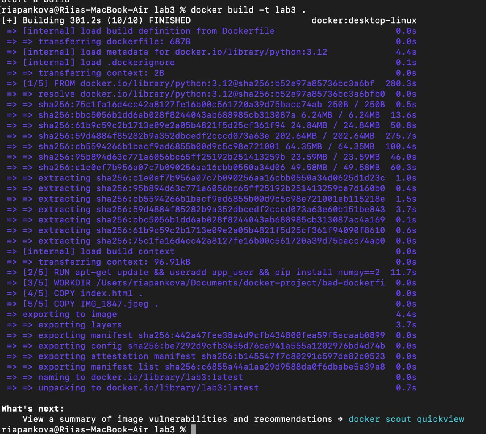
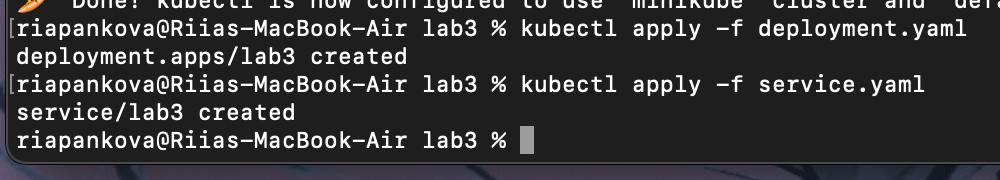
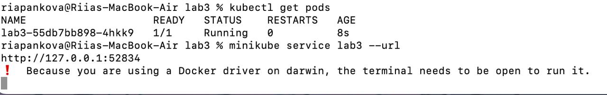
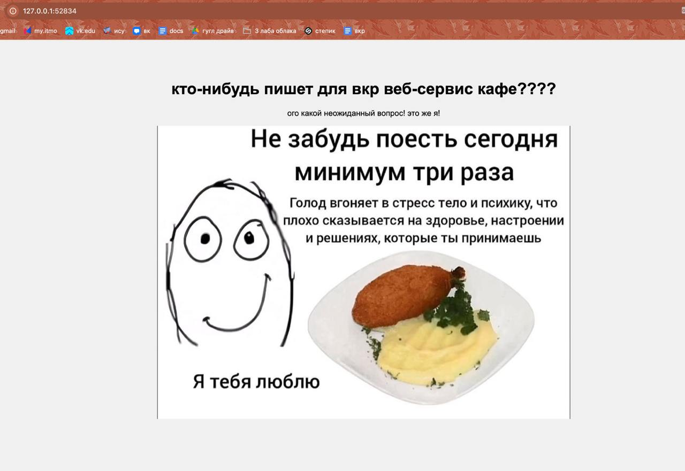
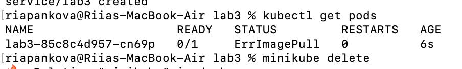

# Лабораторная 3

## Задания для лабораторной

#### Обычная:

Поднять kubernetes кластер локально (например minikube), в нём развернуть свой сервис, используя 2-3 ресурса kubernetes. В идеале разворачивать кодом из yaml файлов одной командой запуска. Показать работоспособность сервиса.
(сервис любой из своих не опенсорсных, вывод “hello world” в браузер тоже подойдёт)

## Выполнение лабораторной

### Обычная:

Для начала мы выяснили, как устанавливать minikube.



В итоге последовательного выполнения инструкции minikube был установлен и включен.



Проверили, что все работает:



После этого создали два файла deployment.yaml и service.yaml. Первый представляет собой объект Deployment, он развертываниет под в кубере, второй описывает сетевой доступ.

Из второй лабораторной взяли хороший докерфайл и написали новый хтмл-документик. Все это обернули в контейнер:



После этого применили yaml-файлы к контейнеру.



После этого с помощью kubectl проверили, что под работает (после пятой лабы забавно наблюдать всего одну строчку...) и попросили ссылку.



По ссылке открыли нашу страничку:



##
П.С. За кулисами происходило вот это:




И я наткнулась на эту проблему на [stackoverflow](https://stackoverflow.com/questions/40600419/why-am-i-getting-an-errimagepull-error-in-this-kubernetes-deployment), там посоветовали вставить в yaml пода ```imagePullPolicy: Never```. Как ни странно, все заработало.
